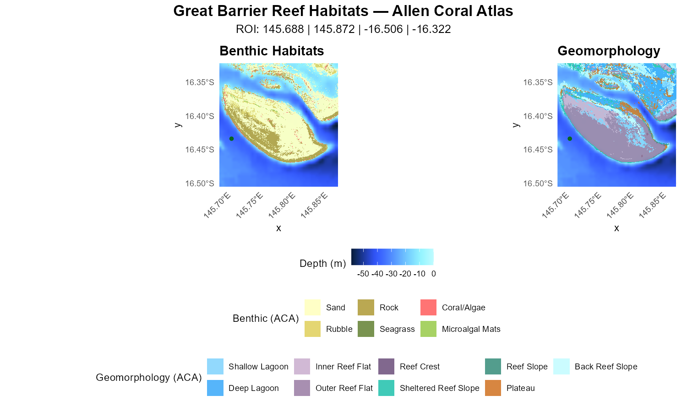
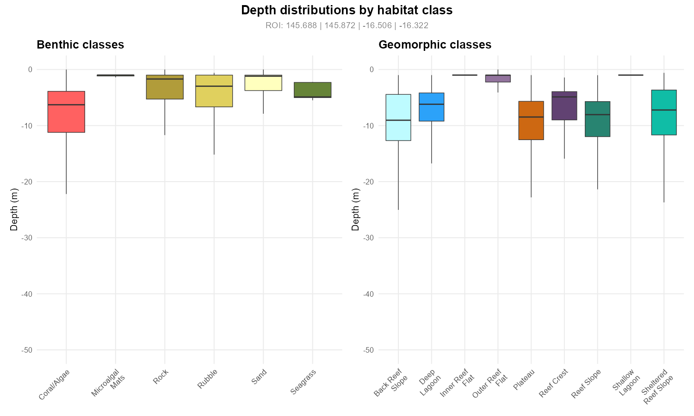
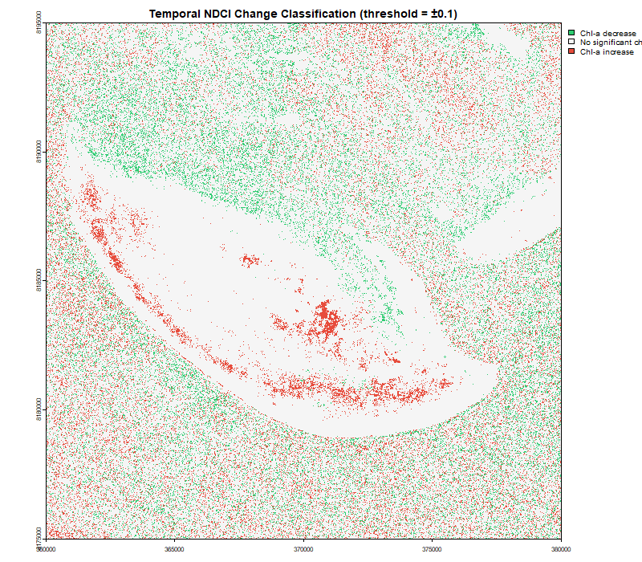

# ReefMappeR

An R package for mapping and analysing reef habitats at the Great Barrier Reef using satellite remote sensing and open marine datasets.

## Overview

ReefMappeR provides a streamlined workflow for researchers and students working with reef ecosystem data. Starting from a bounding box or a Sentinel-2 satellite image, the package automatically loads and crops bathymetry, benthic habitat, geomorphology, and seagrass data to your area of interest — and produces publication-ready maps and summary statistics.

## Installation

```r
# Install from GitHub
# install.packages("devtools")
devtools::install_github("Viktorikowskii/ReefMappeR")
```

## Data Requirements

ReefMappeR ships with bundled datasets for the Great Barrier Reef:

| Dataset | Source | Bundled |
|---|---|---|
| Bathymetry (GBR) | GEBCO 2024 | ✅ `bathymetry_gbr.tif` |
| Benthic habitat tiles (GBR) | Allen Coral Atlas | ✅ `benthic_gbr_*.tif` |
| Geomorphic zone tiles (GBR) | Allen Coral Atlas | ✅ `geomorph_gbr_*.tif` |
| Seagrass polygons (GBR) | UNEP-WCMC | ✅ `seagrass_gbr.shp` |

> **Note:** The bundled datasets cover the Great Barrier Reef region. For other regions, users need to supply their own data files.

## Workflow

```
set_roi()  ──►  plot_habitat_map()
           └──►  habitat_summary()
           └──►  plot_depth_distribution()
           └──►  calc_ndci()  ──►  assess_reef_change()  ──►  compare_habitats_change()
                 calculate_water_quality()
```

## Basic Usage

### 1. Define your region of interest

```r
library(ReefMappeR)

# Using a bounding box (xmin, xmax, ymin, ymax)
bbox   <- c(150.56, 151.30, -21.51, -20.77)
result <- set_roi(bbox = bbox)

# Or using a Sentinel-2 image
s2     <- terra::rast(system.file("extdata", "Sentinel2_example.tif",
                                   package = "ReefMappeR"))
result <- set_roi(s2 = s2)
```

### 2. Visualise habitat maps

```r
plot_habitat_map(result)
```



### 3. Summarise habitat statistics

```r
out <- habitat_summary(result)
out$table          # styled gt summary table
out$stats$benthic  # raw benthic statistics
```


```r
plot_depth_distribution(result)
```



### 4. Analyse water quality from Sentinel-2

```r
s2   <- terra::rast(system.file("extdata", "Sentinel2_example.tif",
                                 package = "ReefMappeR"))

# NDCI — Chlorophyll-a indicator
ndci <- calc_ndci(s2)
```


```r
# Total Suspended Sediments
tss <- calculate_water_quality(s2)
```


### 5. Detect reef change over time

```r
s2_24  <- terra::rast(system.file("extdata", "Sentinel2_2024_example.tif",
                                   package = "ReefMappeR"))
s2_25  <- terra::rast(system.file("extdata", "Sentinel2_example.tif",
                                   package = "ReefMappeR"))

change <- assess_reef_change(calc_ndci(s2_24), calc_ndci(s2_25))
compare_habitats_change(change)
```



## Functions

| Function | Description |
|---|---|
| `set_roi()` | Crop all datasets to a bounding box or Sentinel-2 extent |
| `plot_habitat_map()` | Two-panel map of benthic habitats and geomorphic zones |
| `habitat_summary()` | Area statistics and depth distributions as a table |
| `plot_depth_distribution()` | Depth distributions per habitat class as boxplots |
| `calc_ndci()` | Calculate NDCI from Sentinel-2 bands B4/B5 |
| `calculate_water_quality()` | Estimate TSS from Sentinel-2 |
| `assess_reef_change()` | Compute pixel-wise NDCI difference between two dates |
| `compare_habitats_change()` | Classify and visualise NDCI change |

## Dependencies

ReefMappeR depends on: `terra`, `sf`, `ggplot2`, `ggnewscale`, `dplyr`, `patchwork`, `gt`, `stringr`.

## License

MIT © 2025 Viktoria Veith
