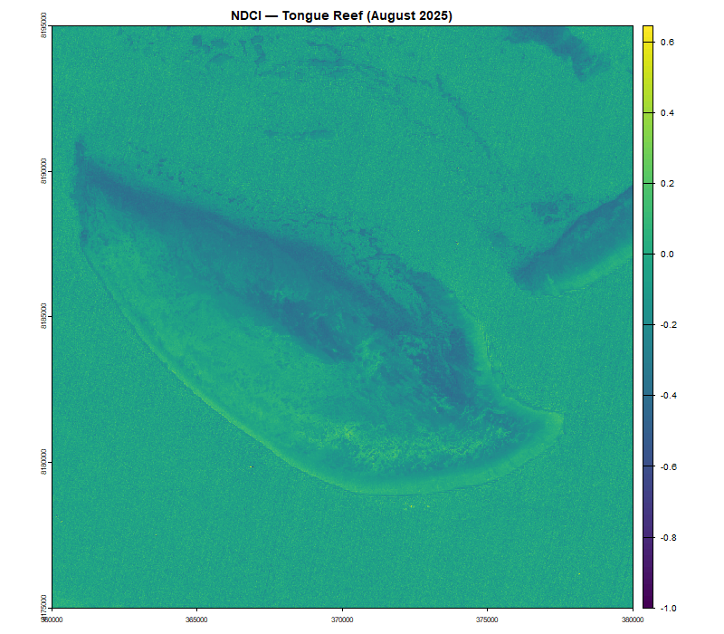
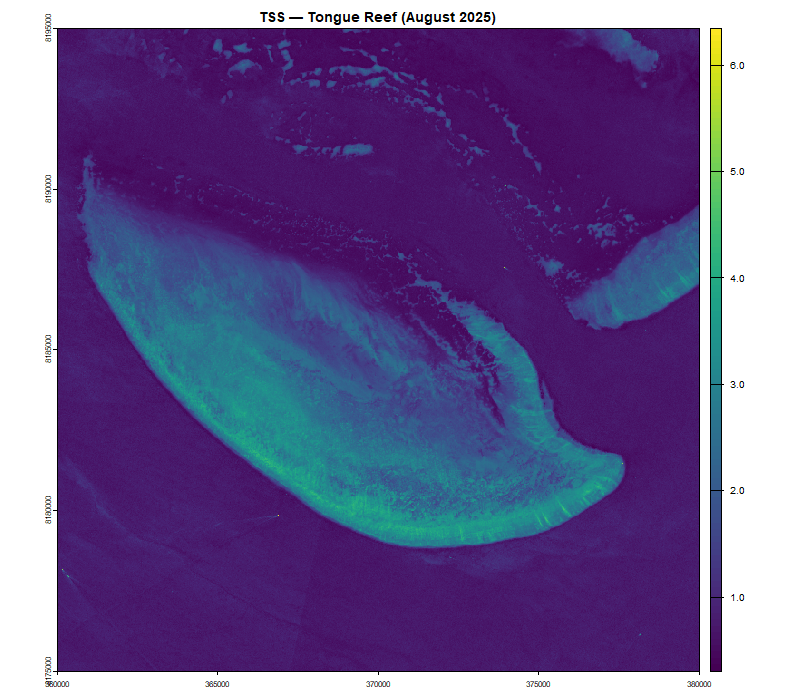

# ReefMappeR

An R package for mapping and analysing reef habitats at the Great
Barrier Reef using satellite remote sensing and open marine datasets.

## Overview

ReefMappeR provides a streamlined workflow for researchers and students
working with reef ecosystem data. Starting from a bounding box or a
Sentinel-2 satellite image, the package automatically loads and crops
bathymetry, benthic habitat, geomorphology, and seagrass data to your
area of interest and produces habitat maps, depth statistics, and water
quality assessments.

For a full tutorial see the [Getting Started
vignette](https://viktorikowskii.github.io/ReefMappeR/articles/getting-started.html).

## Installation

``` r
# install.packages("devtools")
devtools::install_github("Viktorikowskii/ReefMappeR")
```

## Bundled Datasets

ReefMappeR ships with the following datasets for the Great Barrier Reef:

| Dataset | File | Source |
|----|----|----|
| Bathymetry | `bathymetry_gbr.tif` | [GEBCO 2024](https://www.gebco.net) |
| Benthic habitat tiles | `benthic_gbr_*.tif` | [Allen Coral Atlas](https://allencoralatlas.org) |
| Geomorphic zone tiles | `geomorph_gbr_*.tif` | [Allen Coral Atlas](https://allencoralatlas.org) |
| Seagrass polygons | `seagrass_gbr.shp` | [UNEP-WCMC](https://www.unep-wcmc.org) |
| Sentinel-2 (August 2025) | `Sentinel2_example.tif` | [Copernicus](https://dataspace.copernicus.eu) |
| Sentinel-2 (Summer 2024) | `Sentinel2_2024_example.tif` | [Copernicus](https://dataspace.copernicus.eu) |

The benthic and geomorphic data are stored as individual tiles.
[`set_roi()`](https://viktorikowskii.github.io/ReefMappeR/reference/set_roi.md)
automatically identifies and loads only the tiles that overlap with your
region of interest.

## Workflow

    set_roi()
        ├── plot_habitat_map()
        ├── habitat_summary()
        ├── plot_depth_distribution()
        ├── calc_ndci()        ──► assess_reef_change() ──► compare_ndci_change()
        └── calculate_water_quality() ──► assess_reef_change() ──► compare_tss_change()

## Basic Usage

### 1. Define your region of interest

``` r
library(ReefMappeR)

s2     <- terra::rast(system.file("extdata", "Sentinel2_example.tif",
                                   package = "ReefMappeR"))
result <- set_roi(s2 = s2)
```

### 2. Visualise habitat maps

``` r
plot_habitat_map(result)
```


Two-panel habitat map of Tongue Reef showing benthic habitats and
geomorphic zones with bathymetry as background.

### 3. Summarise habitat statistics

``` r
out <- habitat_summary(result)
out$table
```


Habitat summary table showing area, cover and depth statistics per
class.

### 4. Visualise depth distributions

``` r
plot_depth_distribution(result)
```


Depth distributions by habitat class.

### 5. Analyse water quality from Sentinel-2

``` r
s2   <- terra::rast(system.file("extdata", "Sentinel2_example.tif",
                                 package = "ReefMappeR"))
ndci <- calc_ndci(s2)
tss  <- calculate_water_quality(s2)
```



NDCI map of Tongue Reef (August 2025).



TSS map of Tongue Reef (August 2025).

### 6. Detect temporal change

``` r
s2_24   <- terra::rast(system.file("extdata", "Sentinel2_2024_example.tif",
                                    package = "ReefMappeR"))
s2_25   <- terra::rast(system.file("extdata", "Sentinel2_example.tif",
                                    package = "ReefMappeR"))

change_ndci <- assess_reef_change(calc_ndci(s2_24), calc_ndci(s2_25))
compare_ndci_change(change_ndci)

change_tss <- assess_reef_change(calculate_water_quality(s2_24),
                                  calculate_water_quality(s2_25))
compare_tss_change(change_tss)
```


Temporal NDCI Change Classification for Tongue Reef (2024-2025).


Temporal TSS Change Classification for Tongue Reef (2024-2025).

## Functions

| Function | Description |
|----|----|
| [`set_roi()`](https://viktorikowskii.github.io/ReefMappeR/reference/set_roi.md) | Defines the region of interest and automatically loads and crops bathymetry, benthic habitat, geomorphic zone, and seagrass data to the specified extent |
| [`plot_habitat_map()`](https://viktorikowskii.github.io/ReefMappeR/reference/plot_habitat_map.md) | Creates a two-panel map with GEBCO bathymetry as background and Allen Coral Atlas benthic habitats and geomorphic zones overlaid |
| [`habitat_summary()`](https://viktorikowskii.github.io/ReefMappeR/reference/habitat_summary.md) | Computes per-class area, percentage cover, and depth statistics for all habitat classes and returns a styled summary table |
| [`plot_depth_distribution()`](https://viktorikowskii.github.io/ReefMappeR/reference/plot_depth_distribution.md) | Visualises the depth range of each benthic and geomorphic habitat class as boxplots using GEBCO bathymetry |
| [`calc_ndci()`](https://viktorikowskii.github.io/ReefMappeR/reference/calc_ndci.md) | Calculates the Normalized Difference Chlorophyll Index (NDCI) from Sentinel-2 bands B4 and B5 as a proxy for chlorophyll-a concentration |
| [`calculate_water_quality()`](https://viktorikowskii.github.io/ReefMappeR/reference/calculate_water_quality.md) | Estimates Total Suspended Sediments (TSS) in g/m³ from Sentinel-2 surface reflectance bands |
| [`assess_reef_change()`](https://viktorikowskii.github.io/ReefMappeR/reference/assess_reef_change.md) | Computes the pixel-wise difference between two rasters of the same variable at different time points |
| [`compare_ndci_change()`](https://viktorikowskii.github.io/ReefMappeR/reference/compare_ndci_change.md) | Classifies NDCI change into three categories and maps areas of chlorophyll-a increase, decrease, and no significant change |
| [`compare_tss_change()`](https://viktorikowskii.github.io/ReefMappeR/reference/compare_tss_change.md) | Classifies TSS change into three categories and maps areas of sediment increase, decrease, and no significant change |

## Dependencies

`terra`, `sf`, `ggplot2`, `ggnewscale`, `dplyr`, `patchwork`, `gt`,
`stringr`

## License

MIT © 2025 Viktoria Veith
