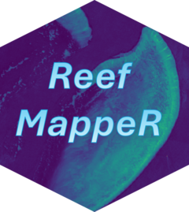

# ReefMappeR <a href="https://viktorikowskii.github.io/ReefMappeR/"></a>

An R package for mapping and analysing reef habitats at the Great Barrier Reef using satellite remote sensing and open-source marine datasets.

## Overview

ReefMappeR provides a streamlined workflow for researchers and students working with reef ecosystem data. Starting from a bounding box or a Sentinel-2 satellite image, the package automatically loads and crops bathymetry, benthic habitat, geomorphology, and seagrass data to your area of interest and produces habitat maps, depth statistics, water quality assessments, and change detection outputs for the Normalized Difference Chlorophyll Index (NDCI) and Total Suspended Sediments (TSS).

## Installation

```r
# install.packages("devtools")
devtools::install_github("Viktorikowskii/ReefMappeR")
```

## Bundled Datasets

ReefMappeR ships with the following datasets for the Great Barrier Reef:

| Dataset | File | Source |
|---|---|---|
| Bathymetry | `bathymetry_gbr.tif` | [GEBCO 2024](https://www.gebco.net) |
| Benthic habitat tiles | `benthic_gbr_*.tif` | [Allen Coral Atlas](https://allencoralatlas.org) |
| Geomorphic zone tiles | `geomorph_gbr_*.tif` | [Allen Coral Atlas](https://allencoralatlas.org) |
| Seagrass polygons | `seagrass_gbr.shp` | [UNEP-WCMC](https://www.unep-wcmc.org) |

The benthic and geomorphic data are stored as individual tiles. `set_roi()` automatically identifies and loads only the tiles that overlap with your region of interest.

## Source Code & Data

The source code and bundled datasets for the Great Barrier Reef are available on GitHub:
[github.com/Viktorikowskii/ReefMappeR](https://github.com/Viktorikowskii/ReefMappeR)
